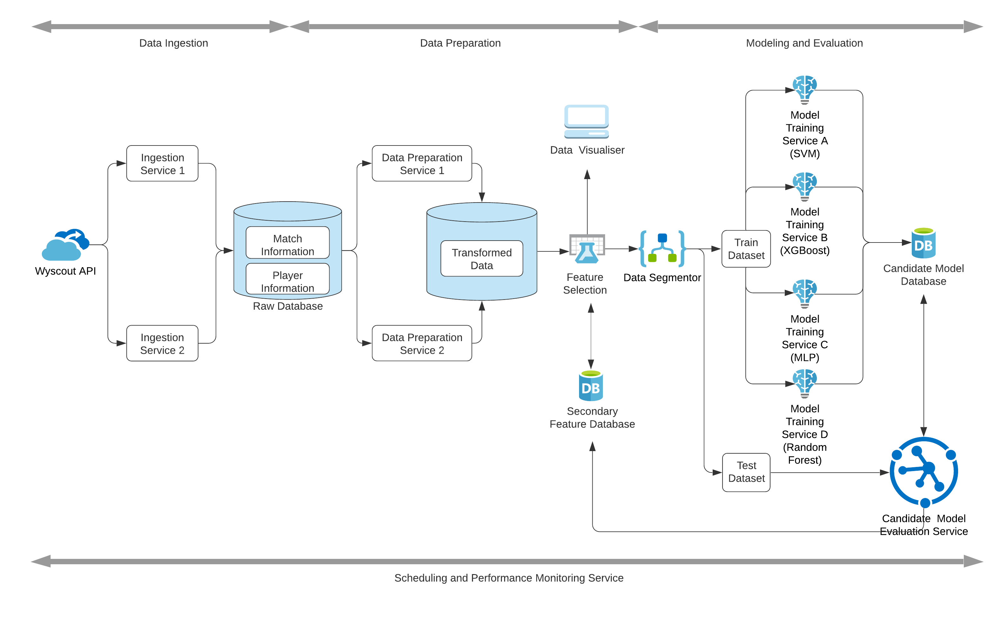
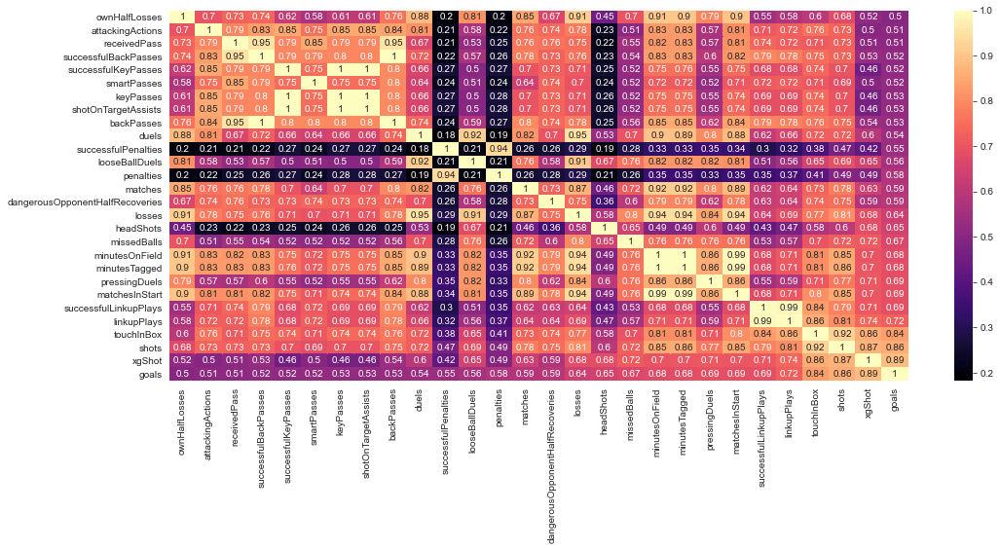
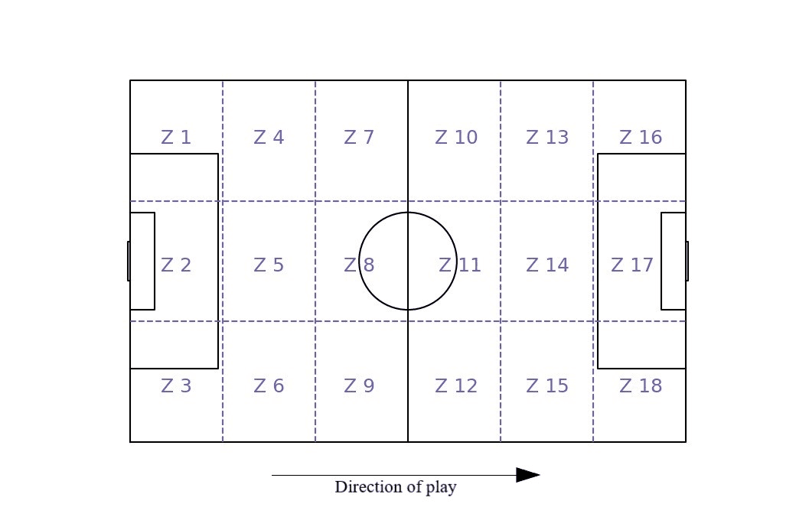
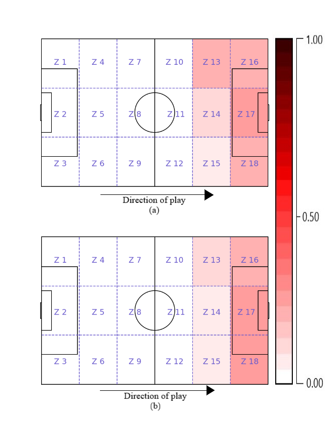
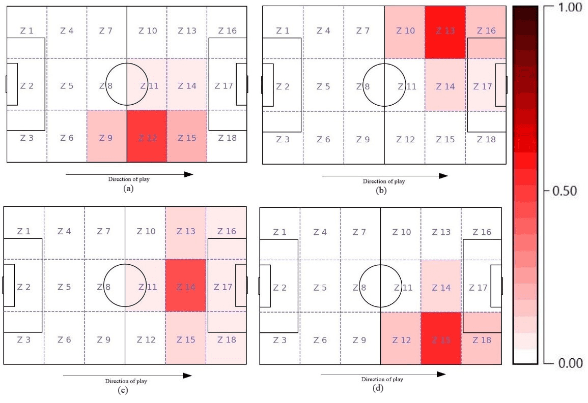

# Shotifier: A Binary Shot Conversion Classifier Pipeline for Football Forwards

In this paper, we present Shotifier, a binary classification pipeline based on the principle of hybrid parallelism. Shotifier focuses on forwards or strikers and uses match statistics for classifying whether the shot from the striker at the opponent's goal converts into a goal or not. Soccer, is one of the most popular sports, is also considered unpredictable as one can expect a lot of unlikely events in every match. The characteristics of being a low scoring game emphasize the importance of the goal of winning a match. However, identifying the factors that have a substantial influence on the player’s position for converting a shot into a goal is a challenging task. Hence, to address this challenge, we have narrowed down our research and analysis on forwards or strikers, who are primarily the goal-scoring players. Shotifier is a hybrid parallelism based pipeline with two steps: (a) The Kernel Density Estimator (KDE) to visually represent high concentrated zones on the ground for specific events in the match along with identification of maximum ball activities based on observed ball's start and end position, (b) From the match statistical data, identify the features that have a strong influence on shots converting to a goal by applying Support Vector Machine (SVM), XGBoost, Random Forest, and Multi-layer Perceptron (MLP) models

The Shotifier pipeline, is based on hybrid parallelism that comprises of three segments. These segments are operated in a sequence to transform and provide correlated data to a model for better classification of shot conversion. Hybrid parallelism is a combination of data parallelism and model parallelism, where it considers partitioning of the training data to parallelise the ML algorithms as present in data parallelism and also partition the model’s execution as present in model parallelism.

For maximum throughput and minimum waiting time for selecting different services, Shotifier pipeline also comprises of Scheduling and Performance Monitoring Service.

The pipeline consists of three processes:

A. Data Ingestion:
The Data Ingestion segment is the first segment in the Shotifier pipeline, where data from Wyscout API is extracted and stored in a database. The extracted data is stored in two different collections, one collection focuses on the players physical and performance statistics (player information), whereas the second collection (match infoprmation) comprises of information related to each match that is played in the EPL 2019-2020 season.

B. Data Preparation:
The data is subjected to scaling and transformations for fature extraction using Pearson Correlation Coefficient. The heatmap of all the feature highly correlated to a forward converting a shot to goal is shown below:

A data visualizer is implemented after feature selection to display high regions of activity and show interzonal acttivites by sectioning and silicing the pitch into 18 equal zones. 
A KDE displays the regions of high density of an event.

To display zonal activities the pitch is divided into zones as below:

To plot the interactions of a specific zone with other zones. The interactions with other zones are plotted onto the football pitch as the percentage of interactions using a color gradient.
  

C. Modeling and Evaluation:
Considering the features provided by the Data Preparation segment, an important task performed by the Model and Evaluation segment is to perform an evaluation of the trained model and recursively improve the performance of the model. This segment begins with the passing of the selected features to the Data Segmentor component. In this component, a custom split of data into Train Dataset and Test Dataset is performed. 70% of the data is selected randomly for Train Dataset, and the rest 30% is considered for the Test Dataset. K-fold cross-validation is implemented in this component to ensure that every observation from the original dataset has the chance of appearing in the Train Dataset and the Test Dataset.
A leader, is responsible for running and scheduling the computation of the slaves updates the model’s replica inside the group. The updates generated by all the different groups are merged and stored inside the Candidate Model Storage Database, as shown in the architecture diagram. The ML models, such as SVM, XGBoost, RF, and Multi-Layer Perceptron (MLP), are trained using the Train Dataset in parallel by the Model Training Service.
Candidate Model Evaluation Service requests the Test Dataset from the Data Segmentor component, for each model sourced from the Candidate Model Storage Database. A library of different evaluators is designed to provide a model’s accuracy metric, that is also saved against the model in the Candidate Model Storage Database. This process is iterative and hyperparameter optimization as well as regularisation techniques, are applied to get the final model. A decrease in the model’s classification accuracy will lead to the restructuring of the model. Thus, if the accuracy reduces, the Performance Monitoring Service retrains the model and maintains an optimal accuracy.
